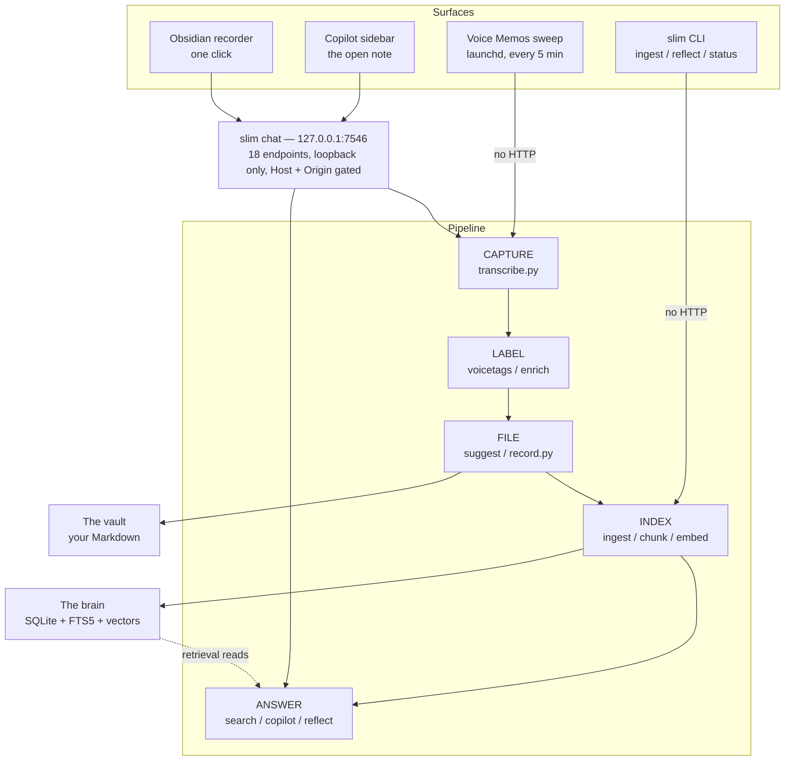
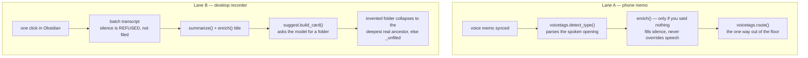
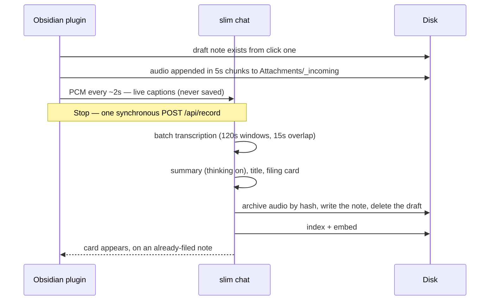
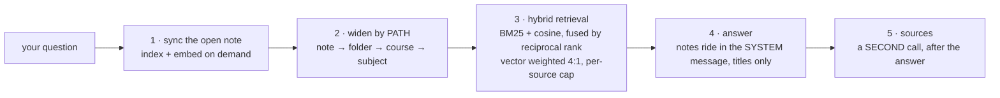

# SLIM — Sparse Local Intelligence & Memory

A private local assistant that lives in an Obsidian vault. You speak; it transcribes,
organizes, reflects, and can talk with you about any of it. Everything runs on one Mac —
local models over Ollama, a SQLite index, and Markdown files you can read without it.

Built to replace a paid Notion subscription whose only load-bearing feature was AI meeting
notes, and whose real failure was simpler: *I click record, it sits somewhere, and I can
never find it again.* So SLIM is not a recorder with a model bolted on. It is the pipeline
that makes spoken audio **filable and findable**, and every design decision below follows
from that.

```
audio  ->  transcript  ->  LABEL  ->  FILE  ->  INDEX  ->  (REFLECT, TALK)
```

---

## Contents

- [How it fits together](#how-it-fits-together)
- [Your vault stays yours](#your-vault-stays-yours)
- [Two capture lanes](#two-capture-lanes)
- [What happens when you record](#what-happens-when-you-record)
- [How answers work](#how-answers-work)
- [Where state lives](#where-state-lives)
- [Requirements](#requirements)
- [Getting started](#getting-started)
- [Code map](#code-map)
- [The rules that shaped it](#the-rules-that-shaped-it)
- [Tests](#tests)

---

## How it fits together

Everything you touch is either Obsidian or the terminal. The Obsidian plugin talks to a
local HTTP server on `127.0.0.1:7546`; the CLI and the scheduled jobs import the same Python
modules directly, with no server in between. The pipeline ends in exactly two places: Markdown
you own, and a SQLite index that can be deleted and rebuilt.



That the CLI bypasses HTTP is not an accident, and it has a consequence worth knowing early:
a `slim chat` server started in a terminal keeps running the code it was launched with, so it
can serve days-old behaviour while your CLI is perfectly current. `GET /api/health` reports
staleness; when in doubt, kill the port.

## Your vault stays yours

**SLIM does not ask you to restructure anything.** Indexing walks every Markdown file in the
vault — `rglob("*.md")` — and skips only three top-level names (`Attachments/`, `Profile/`,
`_Reflections/`), a few dot-folders, and the recorder's own drafts. There is no allow-list of
folders anywhere. A vault organised any way at all is searchable and copilot-ready with no
setup at all.

The folder names SLIM uses are an **output, not a prerequisite**. They appear only when it
writes something, and it creates them itself with their parents:

| Folder | When it appears | What it is |
|---|---|---|
| `Journal/` | first journal entry | the private floor — permanent, flat, and no route ever carries a note out of it |
| `Capture/<subject>/` | first filed recording | every recording, organised by subject and nothing else |
| `Notes/<subject>/` | you make it, if you want it | curated writing; any depth below level 2 is yours |
| `Attachments/` | first recording | archived audio, named by content hash |
| `_Reflections/` | first nightly run | derived synthesis, excluded from indexing |

Subjects are yours — they are the ids you define in `config/projects.yaml`.

**One real friction, named rather than hidden:** the filing card proposes destinations under
`Capture/` and `Notes/` only. It will not offer you folders you already use. A new recording
therefore lands in `Capture/<subject>/`, and you drag it wherever you like afterwards —
because identity is the content hash, not the path, a move keeps the note's history and its
saved copilot chats.

Two degradations, both graceful. Without registered subjects, the copilot's scope ladder
stops at the note's own folder instead of widening further. And a note with `type: journal`
in its frontmatter is read by the nightly reflection wherever it sits, folder or no folder.

## Two capture lanes

Both lanes end in a filed, indexed note, but they decide *what a recording is about* by
opposite means — and this is the part that is easy to get wrong.



The phone lane is **deterministic first**: a spoken opening like *"journaling about…"* is
parsed by code, and the model is consulted only to fill a silence. The desktop recorder
**never calls the spoken-tag parser at all** — it asks the model for a filing card, and then
code constrains the answer to folders that actually exist. Either way the model proposes and
code disposes, which is why a hallucinated path cannot create a folder.

## What happens when you record

The single most load-bearing decision in the product: **the note is filed before the card is
shown.** A confirmation is an action, and actions get abandoned — so nothing waits for
approval. By the time you see a filing card, the note is written, moved and indexed. The card
only adjusts a note that is already on disk and findable.



Live captions and the authoritative transcript come from two separate speech-model instances.
The captions are for your eyes while you speak and are discarded; the note always gets the
batch transcript, because **the transcript is the note** — summary, title and card only
decorate it. A failed or silent transcript is refused rather than filed, and your audio stays
staged so you can retry.

The three model calls in that sequence all share one context window on purpose. Ollama spawns
one runner per model *and context size*, so a second, smaller, bespoke window would not save
memory — it would load a second copy of the model.

## How answers work

Identity is the content hash; the path is an attribute. That is what lets you reorganise
freely. It is also why an edit *and* a move between two indexing runs read as a delete plus a
create — the bytes changed and the old path vanished at the same moment, so nothing links them.
Index before and after a move, and a rename is free.



Two deliberate details. The notes pack carries **titles and no numbers**, so the prose is
structurally unable to fabricate a `[1]`-style citation; attribution is a separate bounded
call that is shown the finished answer and asked which notes it drew on. And scope is always
a *path*, never a similarity score — the copilot is a note- and folder-scoped assistant, not a
vault-wide question answering engine. "When did I first…" is a SQL question about
`authored_at`, and answering it with a similarity score would be wrong.

Quick mode disables model thinking; Deep enables it with a larger budget. The copilot has no
profile in its prompt, cannot edit files yet, and its chat history lives outside the vault and
is never treated as evidence.

Separately, `slim reflect` runs nightly and writes **one** synthesis note into `_Reflections/`
from your recent journals. It is the part of the system that is actually read for pleasure,
and it is create-only — it never overwrites an existing reflection.

## Where state lives

| Where | What | If you deleted it |
|---|---|---|
| the vault | Every note, its frontmatter, its full transcript, archived audio, the reflections. Plain Markdown, readable with SLIM uninstalled. | Everything is gone — this is the only copy that matters. |
| `slim.db` | `sources`, `fragments`, `fragments_fts`, `embeddings`. In Application Support, never in a synced folder. | `slim ingest` rebuilds it — but new source ids orphan saved chats, so schema changes are migrations. |
| outside both | Copilot threads, pasted images, JSONL traces, and the vault pin that stops ingest sweeping the wrong vault. | Chat history and the audit trail are lost; your notes are untouched. |

Raw sources are never rewritten, and derived artifacts are never re-ingested — `_Reflections/`
and `Profile/` are excluded, and the recorder's own summary is blanked before chunking. The
index never retrieves its own opinions as evidence.

**Filed is not the same as findable.** Filing writes a Markdown file; the copilot and the
reflection read SQLite. Anything that writes a note must index *and* embed it, or say plainly
that it did not.

## Requirements

macOS on Apple Silicon. Transcription runs on MLX and the recorder takes system audio from
Core Audio's process tap, so there is no Intel or Linux path. The generative model is the
binding constraint: `qwen3.6:35b` holds roughly 25 GB resident at its full 131k context, which
a 48 GB machine fits comfortably and a 16 GB machine does not.

- **[uv](https://docs.astral.sh/uv/)** — every command is `uv run`, which builds the Python
  3.12+ environment on first use. There is no separate install step.
- **ffmpeg** — `brew install ffmpeg`. `ffprobe` reads the recorder's container and `ffmpeg`
  decodes it; a recording dies without them.
- **[Ollama](https://ollama.com)**, running, with both models pulled:

  ```bash
  ollama pull qwen3.6:35b      # every generative call: summary, title, card, reflect, copilot
  ollama pull embeddinggemma   # the embedder; its task prefixes are load-bearing
  ```

- **Obsidian** 1.5 or newer, desktop. It is the only interactive surface.

The speech model's weights (`mlx-community/parakeet-tdt-0.6b-v3`) download themselves on the
first transcription, so the first one is slow.

## Getting started

**1. Open a vault in Obsidian**, or create one. SLIM installs into the vault it discovers, and
discovery falls back to `~/Documents/Obsidian Vault` whether or not anything is there. An
existing vault of any shape is fine — see [Your vault stays yours](#your-vault-stays-yours).

**2. Name your subjects.** Copy the example and edit it: the subject ids become your folder
names, the aliases are the words you actually say, and `owner` is how the prompts address you.

```bash
cp config/projects.example.yaml config/projects.yaml
```

This file is gitignored and optional — without it SLIM still runs, but nothing is registered,
so every recording lands in `Capture/_unfiled`.

**3. Install the plugin** into that same vault:

```bash
VAULT="${SLIM_VAULT:-$(python3 slim/vaultpath.py)}"
[ -d "$VAULT" ] || { echo "no vault at $VAULT — open one in Obsidian, or set SLIM_VAULT"; exit 1; }
PLUGIN="$VAULT/.obsidian/plugins/slim-recorder"
mkdir -p "$PLUGIN"
cp obsidian/main.js obsidian/manifest.json obsidian/styles.css "$PLUGIN/"
```

Then enable **SLIM** in Community Plugins.

**4. Index what is already there**, and check SLIM resolved the vault you meant:

```bash
uv run slim ingest    # index the vault; embeds at the end
uv run slim status    # prints the vault, the counts, and anything still unembedded
```

If it picked the wrong vault: `export SLIM_VAULT=/path/to/vault`.

**5. Use it.** The microphone icon records; the message icon is the open-note copilot. The
plugin starts `slim chat` when it needs to. A reused server does not hot-reload, so restart a
stale one before testing changes:

```bash
lsof -tiTCP:7546 -sTCP:LISTEN | xargs kill
```

The full command set:

```bash
uv run slim ingest                        # index the vault; embeds at the end
uv run slim status                        # index health, incl. fragments still unembedded
uv run slim memos --container <dir>       # sweep synced Voice Memos -> transcribe -> index
uv run slim reflect                       # journal window -> ONE reflection note
uv run slim chat                          # the Obsidian plugin's server, 127.0.0.1:7546
uv run slim trace -n 1                    # replay the last traced operation
```

Optional background jobs, each installed by its own script in `scripts/`: the Voice Memos
sweep every five minutes, the reflection nightly, and a restic backup of the vault daily.

## Code map

- `slim/cli.py` — the entry point; six commands.
- **Capture** — `chat.py` (the plugin's API server), `record.py` (the sole writer of a
  recorded note), `transcribe.py` (two speech lanes), `summarize.py`, `suggest.py` (the filing
  card), `enrich.py` and `voicetags.py` (labelling), `inbox.py` and `voicememos.py` (the memo
  lane).
- **Index** — `ingest.py`, `chunk.py` (fragments; the frontmatter reader and writer),
  `embed.py`, `db.py`.
- **Answer** — `search.py`, `copilot.py`, `threads.py`, `copilot_images.py`, `reflect.py`.
- **Seams** — `llm.py` (never call Ollama directly), `trace.py`, `config.py`, `vaultpath.py`.
- `obsidian/main.js` — the entire plugin: recorder and copilot, plain CommonJS, no build step.
- `CLAUDE.md` — the operating brief, including the traps that cost real debugging time.
- `BACKLOG.md` — what is next. Open items only.

## The rules that shaped it

- **Deterministic truth in code.** Hashes, ids, timestamps, filters and paths are code. The
  model is for interpretation, classification, synthesis and language — never for a fact the
  machine already knows.
- **`Journal/` is a floor, and the floor is a path.** No route carries a note out of it, and a
  test enforces that.
- **Subject is the only folder axis.** A path encodes one fact; type, course and status live in
  frontmatter where they can be queried. Two path segments is the ceiling — also test-enforced.
- **The note is filed before the card is shown.** Nothing waits for approval.
- **Autonomous writes are fine, and they are traced.** Provenance stays in frontmatter;
  `trace.record` logs machine facts — never prose, never chain-of-thought — for every stage,
  turn and refusal.
- **Prefer deleting a leash to adding a belt.** Roughly 60k lines have been cut from this
  project on purpose. Judge a feature by "would the owner miss it", not "is it well-built".

## Tests

Both suites run without Ollama, a vault, or any of the model weights — ffmpeg is the one
binary the recorder tests genuinely need, because they exercise real container handling:

```bash
brew install ffmpeg               # ffprobe is a real dependency of the recorder tests
uv run pytest -q                  # the Python side
node --test obsidian/*.test.mjs   # the plugin; no build step, no dependencies at all
```

That property is deliberate — it is what keeps the system inspectable, and it is what CI runs
on every push. The plugin suite needs nothing but Node.

## License

MIT. See [LICENSE](LICENSE).
